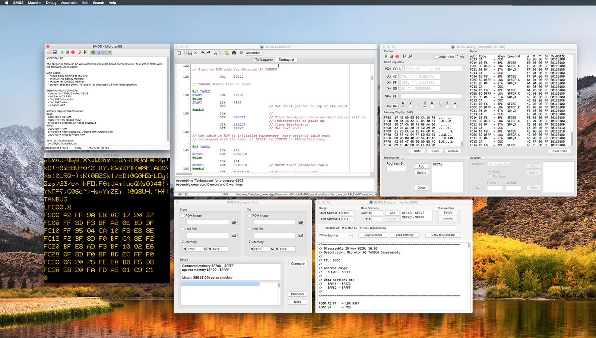
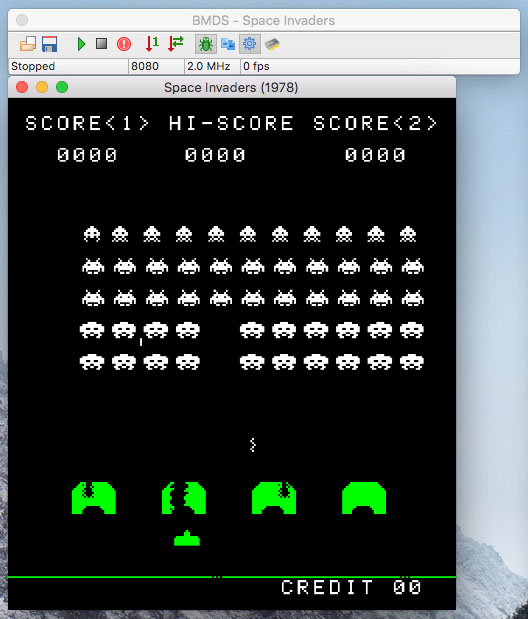
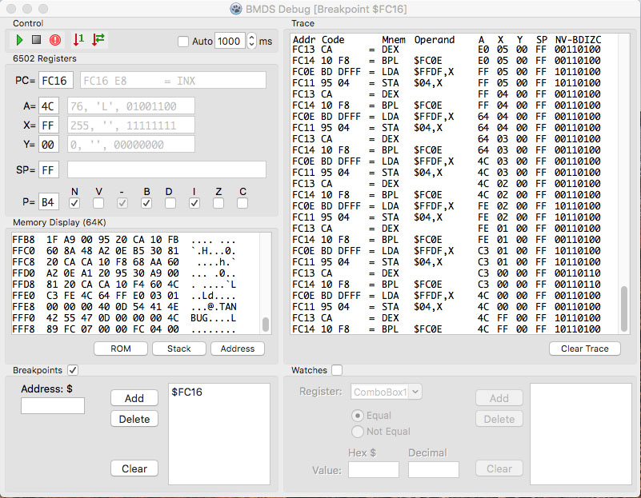
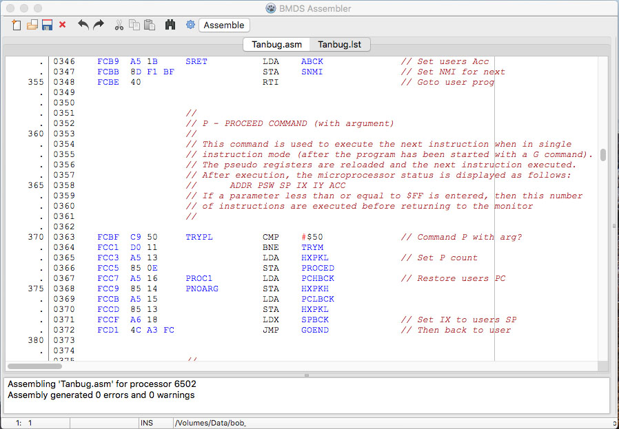
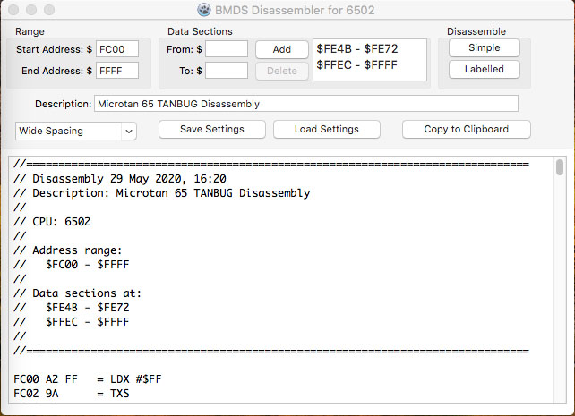

## BMDS

BMDS started life as an emulator for the Microtan 65, and was known as MDS (Microtan Development System). Having got most of that working, I moved on to emulating Space Invaders building on the existing architecture, then the CHIP-8. As a result it became BMDS (Beyond the Microtan Development System)!.

## Introduction

BMDS is written with Lazarus / Free Pascal, although it was originally coded for Delphi, and should work on Windows as well as Mac. In fact with mods it can probably be made to work on most platforms given the flexibility of Lazarus/FPC.

Functionality includes:

- **Microtan 65 Emulation**: the very first 'computer' that I had using a 6502 at 750kHz

- **Space Invaders Emulation**: a game I really enjoyed playing as a kid with 8080 processor (see image below)

- **CHIP-8 Emulation**: I played Pong with my friends on one of the early consoles as a kid and thought I would revive it

The main control panel buttons support run, stop and reset of the emulated machine. The machine screen window can be resized, and supported machine options changed through the preferences panel

In addition there is a developer mode which gives access to several other windows with some of the following additional functionality per machine:

### Debug

Debug offers a multi-frame window repeating the run / stop / reset / step controls of the main panel and adds the facility to single step automatically at a given rate. The various debug frames show Register states including status flags, machine Memory, a Trace of the last instructions processed, and Breakpoints where the machine can be run free until it reaches specific addresses when it will stop.

### Assembler

The 6502 and 8080 have assembler support (CHIP-8 still in work), with a syntax highlighted editor offering a two-pass assembly with conditional assembly and macros. Output can be direct to the machine's memory, to binary or hex files. 

### Disassembler

Something I have always enjoyed doing is finding out how code works, and disassembly is essential to that. Each machine supports disassembly for its associate processor, and gives output in a simple format with machine code and associated mnemonics, or an 'assembler ready' format with auomatically generated labels. If a machine definitions file is available the labels can be replaced with more meaningful ones. Once data sections have been identified these can be added and will generate byte values rather than code. All settings can be saved and recalled as required.

### Compare

There is also a data compare window allowing byte-by-byte comparison of binary images, hex files or memory.

## Build Notes

When compiling, Lazarus/FPC will put all build files in a "*_build*" folder, and the executable in a "*_bin*" folder. I put the underscore in front of these (and some other folders) to remind me which folders do not need to be pushed to GitHub.

### Windows

Not yet tested on Windows.

### Mac

Having cloned / downloaded the files there are some additional preparations required:

- **Create App bundle**: create a ".app" bundle for *BMDS* via Lazarus' "*Project | Project Options*" and the "*Create Application Bundle*" button. This will put a ".app" file in the *_bin* folder with the *BMDS* executable

- **Copy resources to App bundle**: copy the contents of the *Resources* folder, with the machine ROMS etc, into the BMDS ".app" package (*BMDS.app/Contents/Resources* folder)

- **Install SDL2 Framework**
  - Download DMG from www.libsdl.org
  - Copy *SDL2.framework* to */Library/Frameworks/*. If have issues with permissions then double click DMG, then in Terminal window type:
    “sudo cp -r /Volumes/SDL2/SDL2.framework /Library/Frameworks/“ with admin password

Note: when ready to use the ".app" file elsewhere ensure you move the *BMDS* executable file into the *BMDS.app/Contents/MacOS/* folder, replacing the alias put there by Lazarus. Put the ".app" file in a DMG file for distribution

## License

This software has been released under the [GNU General Public License](https://www.gnu.org/licenses/) as published by the Free Software Foundation

