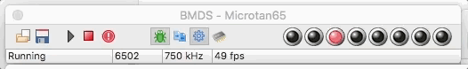

## Knight Rider

This little program emulates the scanning light from the front of the Knight Rider TV series car known as KITT, using the LEDs on the BMDS control panel.

 It can be run in two ways:

### Assemble the Source File

Ensure that *Write code to memory* option is selected in the Preferences|Assembler panel. Then load the *.ASM* file into the assembler form, and click *Assemble*. This creates the assembly code, lists the resultant assembly code, but also copies the code direct to memory. Then *Run* the emulator and type *G400* to execute the code starting at $400. The LEDs should scan.

### Load the Saved Machine *.m65* File

Either select the *Load...* menu option, or *Load code* button, or drag and drop the *.m65* file onto the control panel to load the file. The screen will show the saved instructions (*created with the Machine|Edit Screen* option). *Run* the machine, and type the *G400* instruction to execute the code starting at $400.